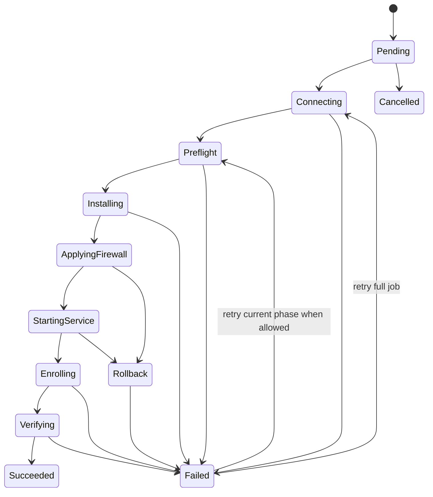

# Install Job State Machine

## Purpose
Define a deterministic onboarding pipeline for a VPS node so the backend, UI, and agent all agree on install progress and recovery behavior.

## Primary States
- `Pending`
- `Connecting`
- `Preflight`
- `Installing`
- `ApplyingFirewall`
- `StartingService`
- `Enrolling`
- `Verifying`
- `Succeeded`
- `Failed`
- `Cancelled`
- `Rollback`

## State Transitions


## Step Definitions
### Connecting
- Open SSH session
- Verify host key if enabled
- Validate auth success

### Preflight
- Detect OS and version
- Check disk, memory, CPU baseline
- Check writable install path
- Check service manager
- Check supported firewall manager
- Check outbound connectivity to backend

### Installing
- Create runtime user if profile requires it
- Create install folders
- Place agent binary
- Place config template
- Set ownership and file mode for app directory

### ApplyingFirewall
- Apply selected profile
- Validate expected rules now exist
- Refuse broad or wildcard exposure

### StartingService
- Install service definition
- Enable service
- Start service
- Confirm process healthy

### Enrolling
- Agent exchanges short-lived enrollment token
- Backend registers capabilities
- Backend stores node fingerprint and version

### Verifying
- Wait for heartbeat
- Validate metrics payload shape
- Validate command polling path

## Retry Policy
- `Connecting`: retry up to 3 times with exponential backoff
- `Preflight`: do not auto-retry failed resource checks
- `Installing`: retry once if package download or transient IO fails
- `ApplyingFirewall`: do not auto-retry if policy validation fails
- `StartingService`: retry once if service start timeout occurs
- `Enrolling`: retry until token expiry, max 2 attempts
- `Verifying`: retry heartbeat wait window once

## Rollback Rules
Rollback may:
- stop the service
- remove service definition
- remove temp files
- leave logs intact

Rollback must not:
- delete unrelated system files
- remove admin users not created by the install profile
- revert firewall beyond the profile transaction scope

## Install Job Record Example
```json
{
  "jobId": "job_01JABCDEF",
  "nodeId": "node_01JABCDEG",
  "status": "Installing",
  "currentStep": "place_agent_binary",
  "attempt": 1,
  "startedAt": "2026-04-10T16:00:00Z",
  "updatedAt": "2026-04-10T16:03:12Z",
  "correlationId": "corr_8b1f1a62",
  "errorMessage": null
}
```
