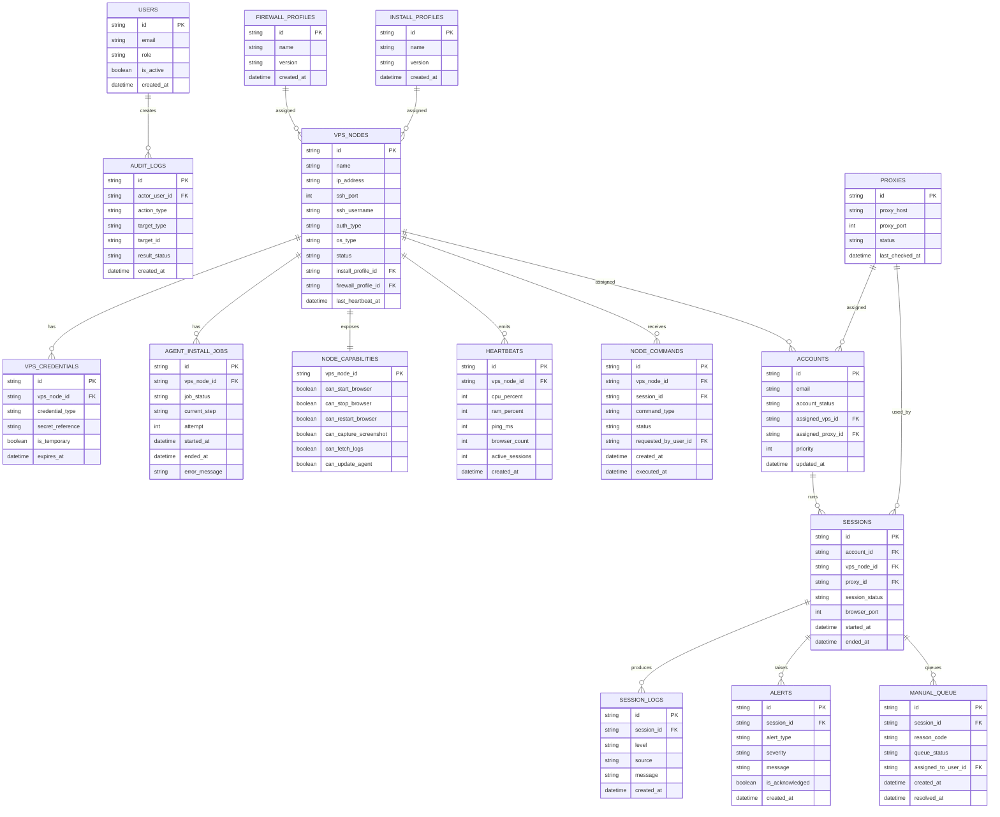

# Database ERD

## Mermaid ERD

## Notes
- Store passwords and secrets by reference, not plaintext.
- Use enums or constrained lookup tables for statuses.
- Partition `session_logs` and `heartbeats` if volume grows.
- `node_capabilities` can be a 1:1 table or a JSON column if flexibility is preferred.

## Suggested indexes
- `vps_nodes(status, last_heartbeat_at)`
- `accounts(assigned_vps_id, account_status)`
- `sessions(vps_node_id, session_status, started_at)`
- `alerts(is_acknowledged, severity, created_at)`
- `manual_queue(queue_status, priority, created_at)`
- `node_commands(vps_node_id, status, created_at)`
- `session_logs(session_id, created_at)`
- `heartbeats(vps_node_id, created_at)`
